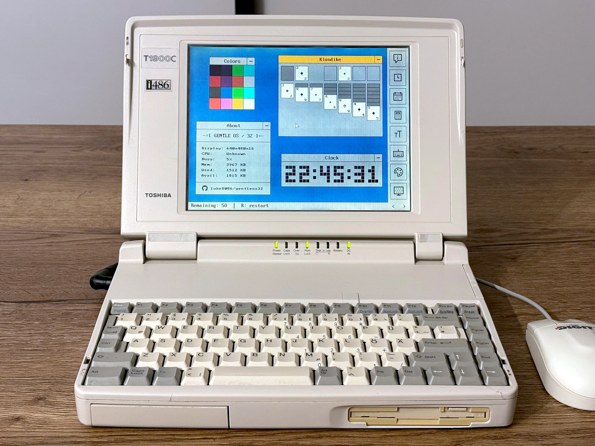
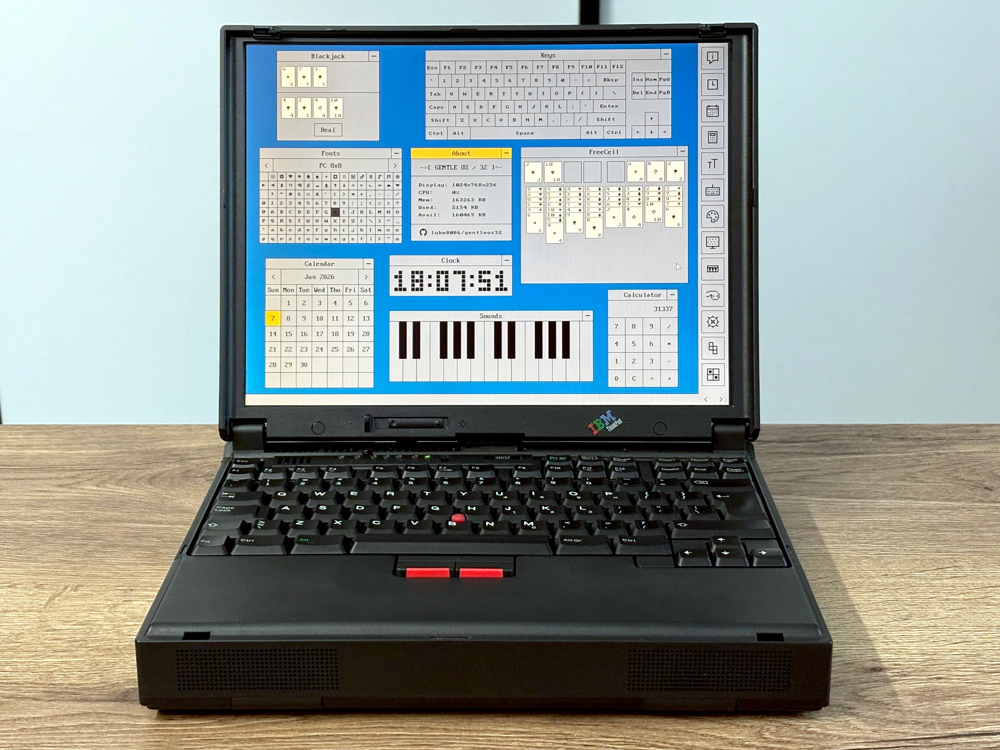
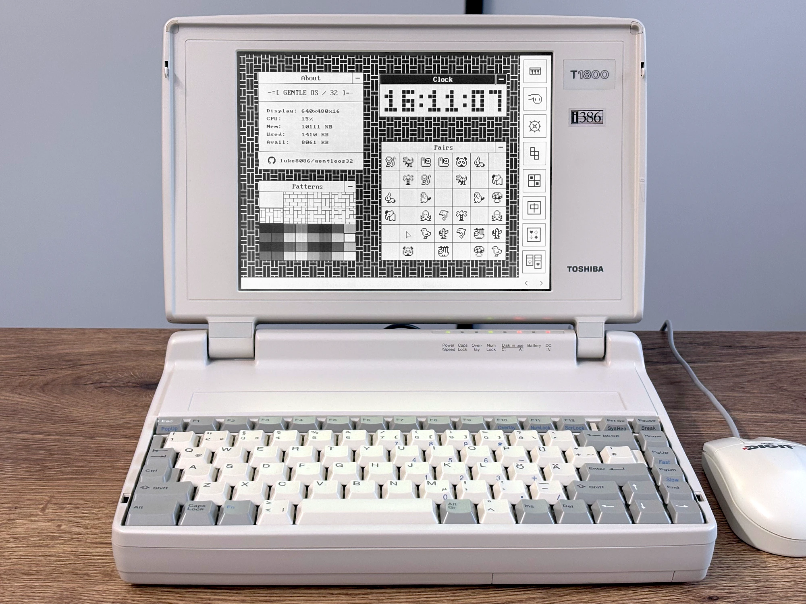
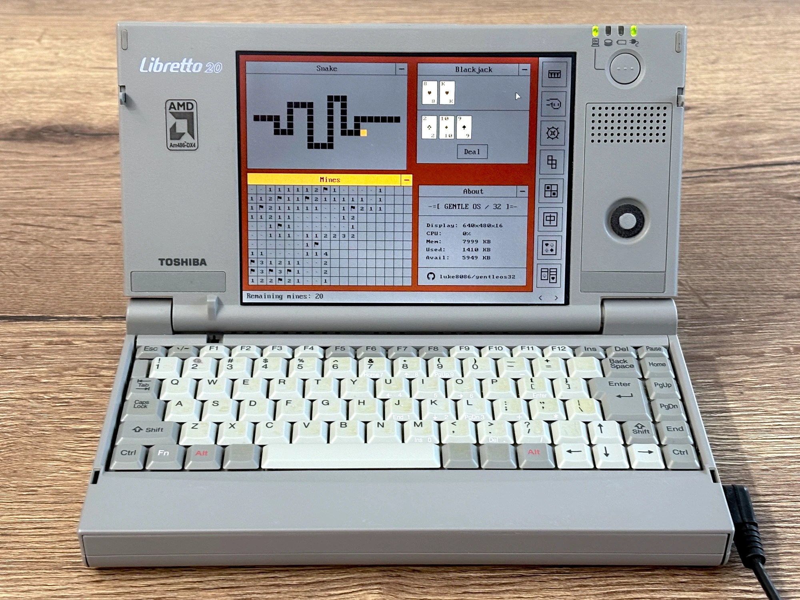
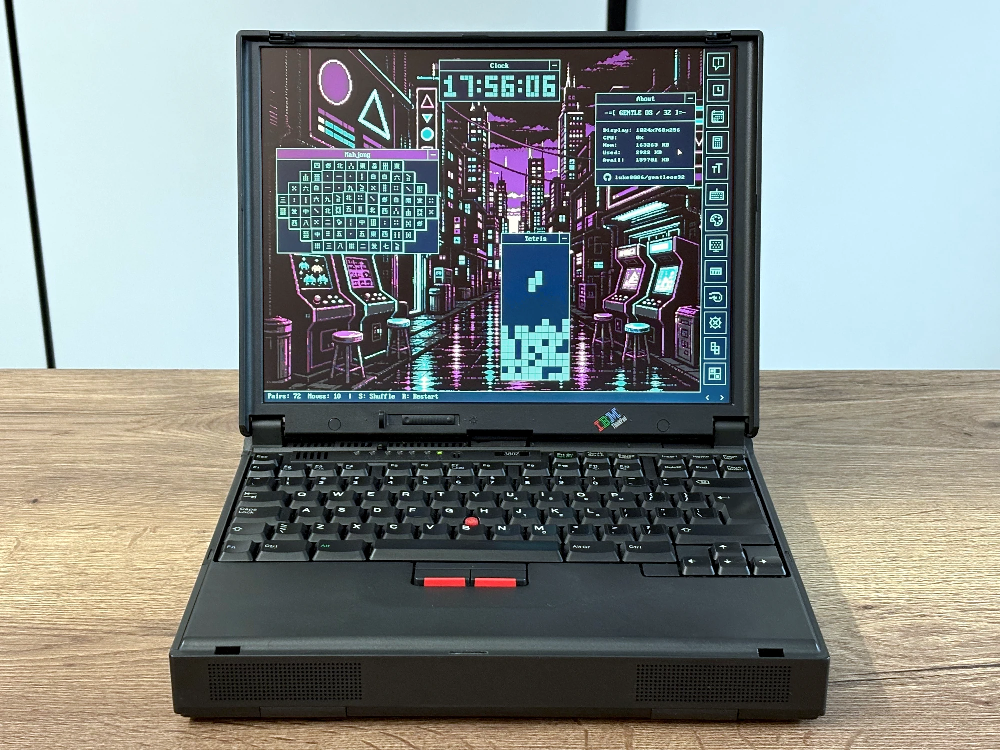

# GentleOS/32

A hobby operating system for vintage 32-bit PCs (i386+).

Its goal is to provide a simple platform for tinkering with retro
hardware and running graphical interactive apps on bare metal.

GentleOS/32 is a sibling of [GentleOS/16](https://github.com/luke8086/gentleos),
a 16-bit OS that targets even older hardware.

For details on building and running, see [USAGE.md](USAGE.md).

## Gallery
 
 

## Attributions

- Assets in [vendor/icons8](vendor/icons8) have been sourced from
  [Icons8](https://icons8.com/) using the
  [free license](https://web.archive.org/web/20260325111643/https://icons8.com/license)
  and modified

- Assets in [vendor/mona](vendor/mona) have been extracted from the
  [Mona Font](https://github.com/MonadABXY/mona-font) and modified
  ([LICENSE](vendor/mona/LICENSE.txt))

- Assets in [vendor/int10h](vendor/int10h) have been extracted from the
  [The Ultimate Oldschool PC Font Pack](https://int10h.org/oldschool-pc-fonts/)
  and modified ([LICENSE](vendor/int10h/LICENSE.txt))

## License

Except where otherwise noted, GentleOS/32 is licensed under [GPLv2](LICENSE).
