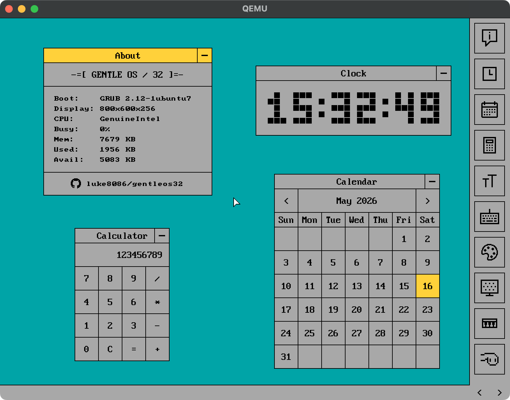
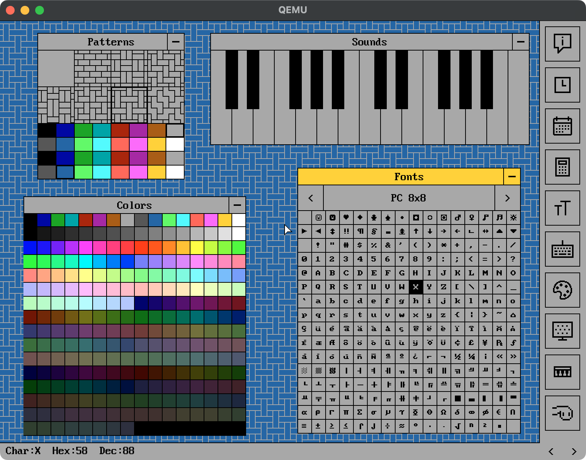
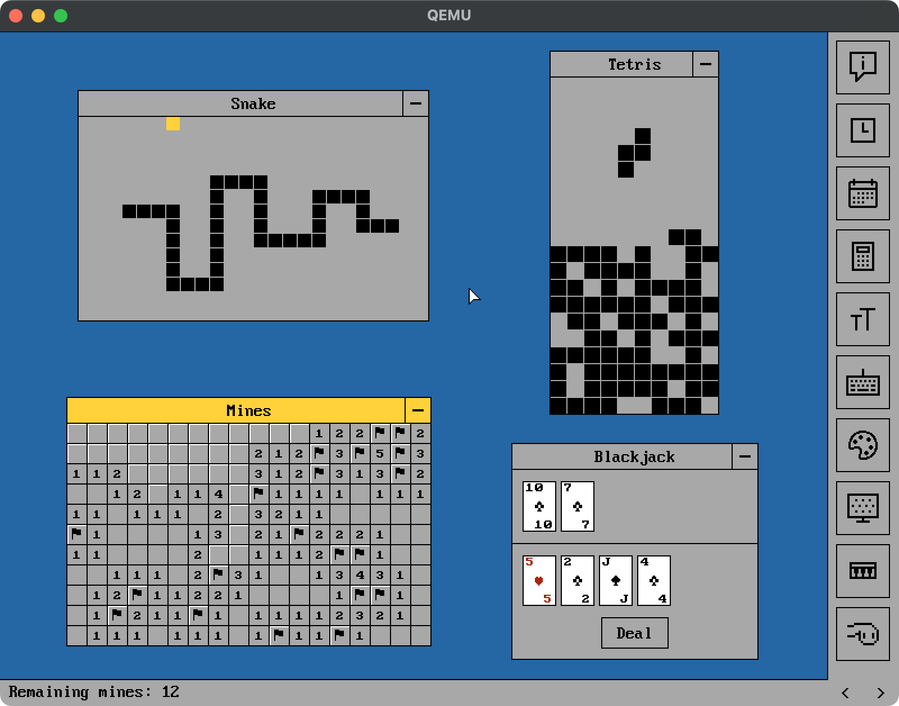
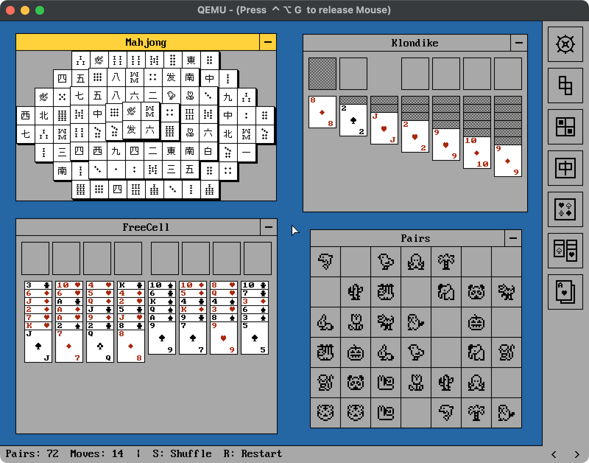

# GentleOS/32

A hobby operating system for vintage 32-bit PCs (i386+).

It's designed as a platform for tinkering with retro hardware, so it
doesn't have most of the features of general-purpose operating systems.
Its goal is to support building user-facing apps with minimal infrastructure.

GentleOS/32 is a sibling of [GentleOS/16](https://github.com/luke8086/gentleos),
a 16-bit OS that targets even older hardware.

 
 

## Building

- Make sure to have Docker & Docker Compose installed
- Copy `config.sample.h` to `config.h` and optionally adjust any settings
- Run `docker compose run --rm dev make -j4`
- To clean up docker artifacts, run: `docker compose down --rmi all`

## Running in QEMU

Run:

```bash
qemu-system-i386 -drive format=raw,file=build/disk.img -m 8 -debugcon stdio
```

For audio support on Macs, also add:

```bash
-audiodev coreaudio,id=snd0 -machine pcspk-audiodev=snd0
```

## Running on real devices

> [!WARNING]
> The author takes no responsibility for any lost data
> or damaged hardware. Proceed at your own risk, and only if you
> fully understand what you're doing.

To prepare a bootable HDD/pendrive, run the following command.
Note it'll **permanently destroy** data on the target disk, and there
will be no confirmation prompt.

```bash
dd if=build/disk.img of=<TARGET DISK> bs=1M conv=fsync status=progress
```

Alternatively, if you already have GRUB installed on the target machine,
you can have it boot `gentleos.elf` directly
(see [misc/grub.cfg](misc/grub.cfg) for a sample config).

## Attributions

- Assets in [vendor/icons8](vendor/icons8) have been sourced from
  [Icons8](https://icons8.com/) using the
  [free license](https://web.archive.org/web/20260325111643/https://icons8.com/license)
  and modified

- Assets in [vendor/mona](vendor/mona) have been extracted from the
  [Mona Font](https://github.com/MonadABXY/mona-font) and modified
  ([LICENSE](vendor/mona/LICENSE.txt))

- Assets in [vendor/int10h](vendor/int10h) have been extracted from the
  [The Ultimate Oldschool PC Font Pack](https://int10h.org/oldschool-pc-fonts/)
  and modified ([LICENSE](vendor/int10h/LICENSE.txt))

## License

Except where otherwise noted, GentleOS/32 is licensed under [GPLv2](LICENSE).
